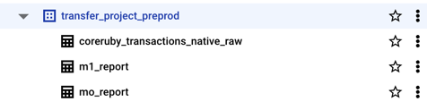

# README

This is sample dbt repo for interview purpose

Please provide answers for these following questions:
* What are each of the files for?
* How to run this project and what results we expect.

List some of this solution's design problems and compare to dbt projects best practices.

This project runs every model as a separated dbt project.  
Provide an alternative solution to put everything in one single dbt project that can handle all the environments(targets) and all models.

You don't need to run it, just provide a new repo containing the new solution's code.  
Provide your analysis and suggestions if there are many ways to achieve the same results.

# DBT Project - Resolution

## Overview

This document provides insights into the structure and functionality of the DBT project, including explanations of each file, design considerations, and recommendations for best practices.

## File Descriptions

1. **`dbt_command_loop.sh`**  
    ```bash
    #!/bin/bash
    # Script to run DBT commands for all the tables mentioned in table_config.yml
    
    #table_config="table_config.yml"
    table_config=$1
    env=$2
    
    echo "Current working directory of the shell script dbt_command_loop.sh: " "$(pwd)"
    
    IFS=''
    if [ "$env" == "preprod" ]; then
       dbt_run_cmd='dbt run --profiles-dir /data-domain-pipelines --project-dir /data-domain-pipelines/my_transfer/ --target preprod-ca --models'
    elif [ "$env" == "prod" ]; then
       dbt_run_cmd='dbt run --profiles-dir /data-domain-pipelines --project-dir /data-domain-pipelines/my_transfer/ --target prod-ca --models'
    else
       dbt_run_cmd='dbt run --profiles-dir /data-domain-pipelines --project-dir /data-domain-pipelines/my_transfer/ --target dev-uk --models'
    fi
    
    cnt=1
    
    concatenate_args()
    {
      # This will concatenate all the DBT_ arguments in one line
      line_converted=$(echo ${1//: /=})
      dbt_args="${2} $line_converted"
    }
    
    create_dbt_cmd()
    {
      # It will create final DBT command per table block which will then be executed directly
      final_dbt_cmd="${dbt_args} ${dbt_run_cmd} ${models}"
      echo "This is the DBT command: " "$final_dbt_cmd"
      /bin/sh -c "$final_dbt_cmd"
      if [ $? -gt 0 ]
        then
          count_failed_result "$failed_result"
      fi
    }
    
    count_failed_result()
    {
      # This is to count the number of tables failed to load that day
      failed_result=$((failed_result + 1))
    }
    
    # Read each line from configuration file
    while read -r line || [ -n "$line" ]; do
      # Checks if the line start with "  D" meaning all the DBT_ arguments then concatenate
      if [ "${line:0:3}" == "  D" ]
        then
          concatenate_args "$line" "$dbt_args"
          cnt=$((cnt + 1))
          new_line=1
      # This elif is to capture the model folder to run
      elif [ "${line:0:8}" == "  MODELS" ]
        then
          models=${line:10}
      # This elif will execute only if there is either a new table block started, and it will be ignored at the first line of the configuration
      elif [ "$cnt" != 1 ] && [ "$new_line" == 1 ]
        then
          create_dbt_cmd "$dbt_args" "$dbt_run_cmd" "$models" "$final_dbt_cmd"
          dbt_args=''
          new_line=0
      # Just switching off the flag new_line which will be checked again outside of while loop
      else
        new_line=2
      fi
    done < "$table_config"
    
    # New_line is just a flag used internally to know when a new table block has started
    if [ $new_line == 1 ]
      then
        create_dbt_cmd "$dbt_args" "$dbt_run_cmd" "$final_dbt_cmd"
    fi
    
    # If any DBT command fails in execution, it will exit the script with error at the end so that all the commands can run and complete first.
    if [ "$failed_result" -gt 0 ]
      then
        echo "$failed_result command/s has/have failed"
        exit 1
    fi
    ```

    This script automates running DBT commands for tables specified in a configuration file (table_config.yml) across different environments (preprod, prod, or dev). It reads configuration details from the specified file, builds appropriate DBT commands per table, and executes them sequentially, handling any errors along the way.
   ```bash
   Usage:
   ./dbt_command_loop.sh <table_config_file> <environment>
   ```
   - Parameters:
      - **`<table_config_file>:`** The path to the YAML configuration file (e.g., table_config.yml) for loading tables env variables.
      - **`<environment>:`** The target environment to run the DBT commands in. Valid options are:
        - preprod: Uses the preprod-ca target.
        - prod: Uses the prod-ca target.
        - Any other value (or omission of this parameter) defaults to dev-uk. Note that the picked profile should exist in profiles.yml
          ```
          domain_dbt:
            outputs:
              prod:
              dataset: transfer_project_prod
              job_execution_timeout_seconds: 300
              job_retries: 1
              location: europe-west3
              method: oauth
              priority: interactive
              project: sb-stul-20241030-175302
              threads: 1
              type: bigquery
             
             preprod:
               dataset: transfer_project_preprod
               job_execution_timeout_seconds: 300
               job_retries: 1
               location: europe-west3
               method: oauth
               priority: interactive
               project: sb-stul-20241030-175302
               threads: 1
               type: bigquery
            target: preprod  # Set the default target here, or override with --target
          ```
        
   - Script Behavior:
      - **`Environment-Specific Commands:`** The script sets the DBT command (dbt_run_cmd) based on the chosen environment, adjusting the profiles and project directories accordingly.
      - **`Reading Configurations:`**  Reads table_config.yml line by line:
        - **DBT Arguments:** Lines beginning with D are parsed as DBT arguments.
        - **Model Folder:** Lines beginning with MODELS specify which model folder to run.
   - Building & Executing Commands:
      - **Command Creation:** Constructs a DBT command per table and executes it.
      - **Error Handling:** Tracks failures for each table, counting them in failed_result.

   - Final Output: If any commands fail, the script outputs the total failed commands and exits with a non-zero status code.

   ### Issue with the existing script:
      - There is an issue with the failed_result counter in the script. The variable failed_result is not initialized before it is used in the function count_failed_result. This can lead to an error when you attempt to increment it if it doesn't already have a numeric value.
      - the --target option in dbt_run_cmd is hardcoded instead of dynamically using the env variable passed as the second parameter. Currently, the script sets the dbt_run_cmd based on a conditional check for "preprod", "prod", or anything else (defaulting to "dev"), but it could be simplified by directly using the value of $env.
      - Fixed Version of **`dbt_command_loop.sh`**
        ```bash
        #!/bin/bash
        # Script to run DBT commands for all the tables mentioned in table_config.yml
        
        #table_config="table_config.yml"
        table_config=$1
        env=$2
        failed_result=0
        
        echo "Current working directory of the shell script dbt_command_loop.sh: " "$(pwd)"
        
        IFS=''
        if [ "$env" == "preprod" ]; then
        dbt_run_cmd="dbt run --profiles-dir  ~/.dbt/ --project-dir . --target $env --models"
        elif [ "$env" == "prod" ]; then
        dbt_run_cmd="dbt run --profiles-dir  ~/.dbt/ --project-dir . --target $env --models"
        else
        dbt_run_cmd="dbt run --profiles-dir  ~/.dbt/ --project-dir . --target $env --models"
        fi
        
        cnt=1
        
        concatenate_args()
        {
        # This will concatenate all the DBT_ arguments in one line
        line_converted=$(echo ${1//: /=})
        dbt_args="${2} $line_converted"
        }
        
        create_dbt_cmd()
        {
        # It will create final DBT command per table block which will then be executed directly
        final_dbt_cmd="${dbt_args} ${dbt_run_cmd} ${models}"
        echo "This is the DBT command: " "$final_dbt_cmd"
        /bin/bash -c "$final_dbt_cmd"
        if [ $? -gt 0 ]
        then
        count_failed_result "$failed_result"
        fi
        }
        
        count_failed_result()
        {
        # This is to count the number of tables failed to load that day
        failed_result=$((failed_result + 1))
        }
        
        # Read each line from configuration file
        while read -r line || [ -n "$line" ]; do
        # Checks if the line start with "  D" meaning all the DBT_ arguments then concatenate
        if [ "${line:0:3}" == "  D" ]
        then
        concatenate_args "$line" "$dbt_args"
        cnt=$((cnt + 1))
        new_line=1
        # This elif is to capture the model folder to run
        elif [ "${line:0:8}" == "  MODELS" ]
        then
        models=${line:10}
        # This elif will execute only if there is either a new table block started, and it will be ignored at the first line of the configuration
        elif [ "$cnt" != 1 ] && [ "$new_line" == 1 ]
        then
        create_dbt_cmd "$dbt_args" "$dbt_run_cmd" "$models" "$final_dbt_cmd"
        dbt_args=''
        new_line=0
        # Just switching off the flag new_line which will be checked again outside of while loop
        else
        new_line=2
        fi
        done < "$table_config"
        
        # New_line is just a flag used internally to know when a new table block has started
        if [ $new_line == 1 ]
        then
        create_dbt_cmd "$dbt_args" "$dbt_run_cmd" "$final_dbt_cmd"
        fi
        
        # If any DBT command fails in execution, it will exit the script with error at the end so that all the commands can run and complete first.
        if [ "$failed_result" -gt 0 ]
        then
        echo "$failed_result command/s has/have failed"
        exit 1
        fi
        ```
   

2. **`dbt_project.yml`**  
   The core configuration file for the DBT project. It defines key project settings such as the project name, version, model locations, environment configurations, and other project-level options. It’s essential for directing DBT on how and where to run models and interact with the target database.

3. **`manifest.yml`**  
   It’s possible that manifest.yml is included in the repo by mistake or was left over from a prior configuration attempt. DBT itself will not directly use manifest.yml.

4. **`preprod_table_config.yml` and `table_config.yml`**  
   YAML files with table configuration details specific to different environments (e.g., pre-production and production). They may include settings like table names, schema names, or other environment-specific overrides that adjust model behavior depending on the environment.

5. **`models/schema.yml`**  
   Defines metadata for the models, including data tests, documentation, and descriptions. The provided schema.yml file in the DBT project defines sources—the raw tables in the data warehouse—that DBT models will use as input, but it does not include any data quality tests.
   This file sets up three main source groups: dataset_name, raw, and coreruby. Each source group specifies its database and schema using environment variables (DBT_SRC_GCP_PROJECT and DBT_SRC_GCP_DATASET), allowing the project to adapt seamlessly across different environments. The coreruby source group defines multiple specific tables like transactions, credit_cards, and appointments, each mapped to raw table names through identifiers, ensuring consistent referencing in DBT models.
   While this schema.yml is well-configured for flexible environment management and source referencing, it does not currently include tests, which could help validate data quality by ensuring that key columns (like IDs and timestamps) are unique or not null. Adding such tests would allow DBT to perform data validation automatically, supporting more reliable and error-free transformations.
   ```
   sources:
   - name: coreruby
     description: 'Events from Coreruby Native'
         database: "{{ env_var('DBT_SRC_GCP_PROJECT') }}"
         schema: "{{env_var('DBT_SRC_GCP_DATASET') }}"
         tables:
           - name: 'transactions'
             identifier: "coreruby_transactions_native"
             tests:
               - unique
               - not_null
                 columns:
               - name: id
                 tests:
                   - unique
                   - not_null
               - name: price_cents
                 tests:
                   - not_null
      ```

6. **`models/m0_report/mo_report.sql` and `models/m1_report/m1_report.sql`**  
   SQL files under the `models/` directory that define DBT models for data transformations. These SQL scripts contain the transformation logic to process raw data and produce final outputs (tables or views) within the target database, specifically focusing on the "m0_report" and "m1_report" transformations.

7. **`models/single/default.sql`**  
   Another SQL model within the project, located under `models/single/`. This file may represent a general or default transformation that doesn’t fit into a specific report category, potentially used as a base model or shared transformation.

## Design Issues and Comparison to DBT Best Practices

1. **Separate DBT Projects for Each Model**  
   Running each model as a separate project is uncommon. It often results in redundant configurations and additional maintenance complexity, as each project must be individually configured and managed.

2. **Configuring Multiple Environments**  
   Instead of having separate configurations for environments (e.g., `preprod_table_config.yml` and `table_config.yml`), DBT’s built-in `target` feature can manage environments within a single configuration file. This approach promotes better scalability and simplifies configuration.

### Best Practice Suggestions

- **Consolidate Models**  
  Combine all models into a single DBT project. Use folders within `models/` to organize models by subject area or function (e.g., `reports`, `default`, etc.).

## Suggested Alternative Solution

To improve maintainability and alignment with best practices, we can consolidate all models into one DBT project. Below is a proposed structure and configuration.

### Project Structure

#### Existing Project Structure:
```bash
my_transfer_project/
├── README.md
├── dbt_command_loop.sh
├── dbt_project.yml
├── manifest.yml
├── models
│   ├── m0_report
│   │   └── mo_report.sql
│   ├── m1_report
│   │   └── m1_report.sql
│   ├── schema.yml
│   └── single
│       └── default.sql
├── preprod_table_config.yml
└── table_config.yml
```

#### Refactored Project Structure:
```bash
my_transfer_project/
├── README.md
├── dbt_project.yml
├── dbt_command_loop.sh
├── environments/
│   ├── table_config.yml  # Configuration for different targets
├── models/
│   ├── reports/
│   │   ├── mo_report.sql
│   │   ├── m1_report.sql
│   │   ├── default.sql
├── schema.yml  # Consolidated schema file for all models
```


This setup keeps everything in one project and utilizes dbt_project.yml for environment-specific settings.

Advantages of Consolidation

1. **Simplified Configuration:** Centralized configurations make it easier to manage and modify settings.
2. **Enhanced Organization:** Using folders under models allows clear separation by functionality.
3. **DBT Environment Management:** Using targets within profiles.yml is more flexible and aligns with DBT best practices for handling multiple environments.

This single-project setup allows for scalability, maintains best practices, and simplifies deployment across different environments without the need to manage multiple DBT projects.


## Job Exeuction

### Source Tables in Bigquery (Dataset: coreruby)
Screenshot:


### Output
```
❯ bash dbt_command_loop.sh table_config.yml preprod
Current working directory of the shell script dbt_command_loop.sh:  /Users/stuladhar/Dev/my-transfer-project-refactor
This is the DBT command:     DBT_SRC_GCP_PROJECT="sb-stul-20241030-175302"   DBT_SRC_GCP_DATASET="coreruby"   DBT_GCP_DATASET="transfer_project_preprod"   DBT_SRC_TABLE_NAME="transfer_project_preprod"   DBT_TGT_TABLE_NAME="coreruby_transactions_native" dbt run --profiles-dir ~/.dbt --project-dir . --target preprod --models mo_report
21:18:02  Running with dbt=1.8.8
21:18:03  [WARNING]: Deprecated functionality
The `source-paths` config has been renamed to `model-paths`. Please update your
`dbt_project.yml` configuration to reflect this change.
21:18:03  [WARNING]: Deprecated functionality
The `data-paths` config has been renamed to `seed-paths`. Please update your
`dbt_project.yml` configuration to reflect this change.
21:18:03  Registered adapter: bigquery=1.8.3
21:18:03  Found 3 models, 12 sources, 479 macros
21:18:03  
21:18:04  Concurrency: 1 threads (target='preprod')
21:18:04  
21:18:04  1 of 1 START sql table model transfer_project_preprod.mo_report ................ [RUN]
21:18:06  1 of 1 OK created sql table model transfer_project_preprod.mo_report ........... [CREATE TABLE (0.0 rows, 0 processed) in 2.69s]
21:18:06  
21:18:06  Finished running 1 table model in 0 hours 0 minutes and 3.62 seconds (3.62s).
21:18:06  
21:18:06  Completed successfully
21:18:06  
21:18:06  Done. PASS=1 WARN=0 ERROR=0 SKIP=0 TOTAL=1
This is the DBT command:     DBT_SRC_GCP_PROJECT="sb-stul-20241030-175302"   DBT_SRC_GCP_DATASET="coreruby"   DBT_GCP_DATASET="transfer_project_preprod"   DBT_SRC_TABLE_NAME="transfer_project_preprod"   DBT_TGT_TABLE_NAME="coreruby_transactions_native" dbt run --profiles-dir ~/.dbt --project-dir . --target preprod --models m1_report
21:18:08  Running with dbt=1.8.8
21:18:08  [WARNING]: Deprecated functionality
The `source-paths` config has been renamed to `model-paths`. Please update your
`dbt_project.yml` configuration to reflect this change.
21:18:08  [WARNING]: Deprecated functionality
The `data-paths` config has been renamed to `seed-paths`. Please update your
`dbt_project.yml` configuration to reflect this change.
21:18:08  Registered adapter: bigquery=1.8.3
21:18:09  Found 3 models, 12 sources, 479 macros
21:18:09  
21:18:09  Concurrency: 1 threads (target='preprod')
21:18:09  
21:18:09  1 of 1 START sql table model transfer_project_preprod.m1_report ................ [RUN]
21:18:13  1 of 1 OK created sql table model transfer_project_preprod.m1_report ........... [CREATE TABLE (0.0 rows, 0 processed) in 3.56s]
21:18:13  
21:18:13  Finished running 1 table model in 0 hours 0 minutes and 4.43 seconds (4.43s).
21:18:13  
21:18:13  Completed successfully
21:18:13  
21:18:13  Done. PASS=1 WARN=0 ERROR=0 SKIP=0 TOTAL=1
This is the DBT command:     DBT_SRC_GCP_PROJECT="sb-stul-20241030-175302"   DBT_SRC_GCP_DATASET="coreruby"   DBT_GCP_DATASET="transfer_project_preprod"   DBT_SRC_TABLE_NAME="coreruby_transactions_native"   DBT_TGT_TABLE_NAME="coreruby_transactions_native_raw" dbt run --profiles-dir ~/.dbt --project-dir . --target preprod --models default
21:18:14  Running with dbt=1.8.8
21:18:15  [WARNING]: Deprecated functionality
The `source-paths` config has been renamed to `model-paths`. Please update your
`dbt_project.yml` configuration to reflect this change.
21:18:15  [WARNING]: Deprecated functionality
The `data-paths` config has been renamed to `seed-paths`. Please update your
`dbt_project.yml` configuration to reflect this change.
21:18:15  Registered adapter: bigquery=1.8.3
21:18:15  Found 3 models, 12 sources, 479 macros
21:18:15  
21:18:16  Concurrency: 1 threads (target='preprod')
21:18:16  
21:18:16  1 of 1 START sql table model transfer_project_preprod.coreruby_transactions_native_raw  [RUN]
21:18:18  1 of 1 OK created sql table model transfer_project_preprod.coreruby_transactions_native_raw  [CREATE TABLE (0.0 rows, 0 processed) in 2.27s]
21:18:18  
21:18:18  Finished running 1 table model in 0 hours 0 minutes and 3.13 seconds (3.13s).
21:18:18  
21:18:18  Completed successfully
21:18:18  
21:18:18  Done. PASS=1 WARN=0 ERROR=0 SKIP=0 TOTAL=1

```


### After DBT modeelling
Screenshot:

